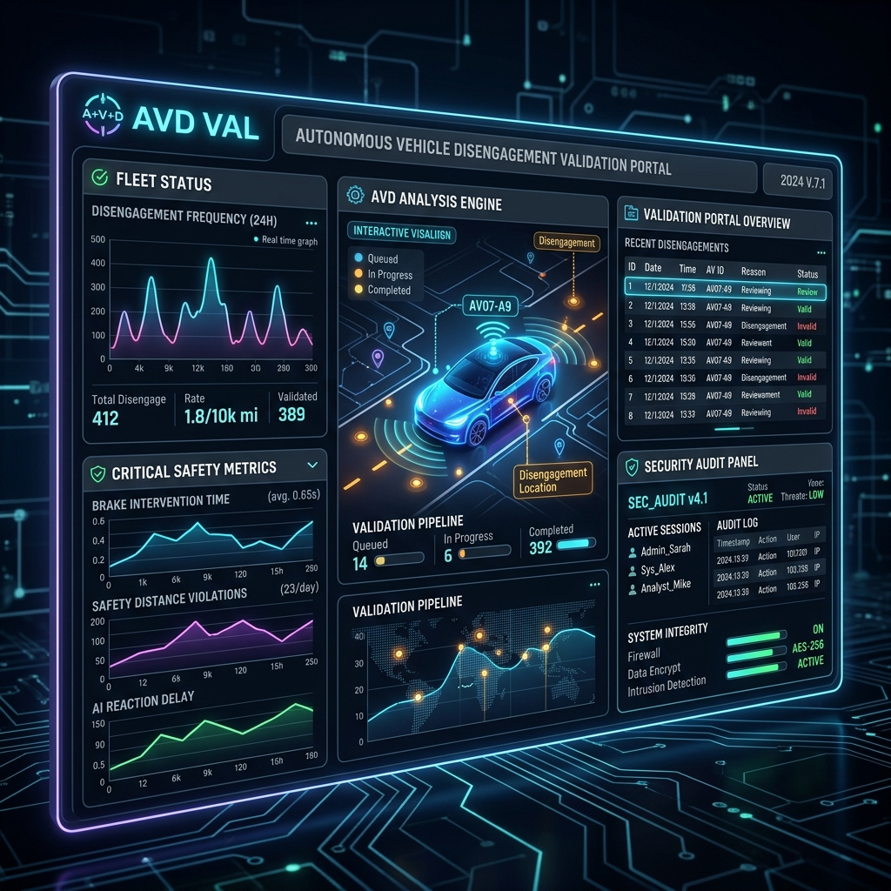

# Autonomous Vehicles Validation Agent

Author: Chong Kiat Lim (associated by Google Antigravity)



> **Production-grade ADK 2.0 agent** for Kaggle's Autonomous Vehicles Validation competition.

## Project Structure

```
.
├── .env                        # 🔑 Local secrets (never committed)
├── .env.example                # Template for onboarding
├── pyproject.toml              # Dependency management (uv / pip)
├── README.md
│
├── src/
│   ├── agent/                  # 🧠 Core orchestrator agent
│   │   ├── __init__.py
│   │   ├── agent.py            # Root ADK Agent definition
│   │   ├── config.py           # Runtime configuration loader
│   │   └── prompts.py          # System prompts & persona
│   │
│   └── skills/                 # 🛠️  Custom ADK tool skills
        ├── kaggle/
        │   └── scripts/
        │       └── pipeline.py
        ├── pii_redactor/
        │   ├── scripts/
        │   │   ├── data_simulator.py
        │   │   ├── enterprise_av_security_pii_cleaner.py
        │   │   ├── redactor.py     # Core redaction logic
        │   │   └── skill.py        # PII redactor ADK Skill wrapper
        │   └── skill.md
        ├── validation/
        │   ├── scripts/
        │   │   ├── label_validator.py
        │   │   ├── report_generator.py
        │   │   └── telemetry_validator.py
        │   ├── assets/
        │   │   ├── av_domain_glossary.md
        │   │   ├── fleet_history.txt
        │   │   ├── guardrails.txt
        │   │   └── rules.txt
        │   └── skill.md
        └── knowledge_retrieval.py
│
└── tests/
    ├── __init__.py
    └── evaluation/             # 🧪 Agent evaluation suites
        ├── __init__.py
        ├── README.md
        ├── conftest.py
        ├── datasets/           # Eval datasets (JSONL)
        └── test_agent_eval.py
```

## Quickstart

```bash
# 1. Clone & enter project
git clone https://github.com/chonlim92/kaggle-competition-autonomousvehicles-validation.git
cd kaggle-competition-autonomousvehicles-validation

# 2. Create virtual environment
python -m venv .venv
.venv\Scripts\activate        # Windows
# source .venv/bin/activate   # macOS / Linux

# 3. Install dependencies
pip install -e ".[dev]"

# 4. Copy env template and fill in secrets
cp .env.example .env

# 5. Run the agent (ADK dev UI)
adk web src/agent/

# 6. Run evaluation suite
pytest tests/evaluation/ -v
```

## Environment Variables

| Variable | Description |
|---|---|
| `GEMINI_API_KEY` | Google Gemini API key |
| `GOOGLE_GENAI_USE_ENTERPRISE` | Use Vertex AI Enterprise endpoint |
| `APP_ENV` | Runtime environment (`development` / `production`) |
| `PII_REDACTION_MODE` | PII masking strategy (`mask` / `redact` / `tokenize`) |

## Architecture

- **Orchestrator** (`src/agent/agent.py`) — Root ADK 2.0 `Agent` with tool routing
- **PII Redactor Skill** (`src/skills/pii_redactor/`) — Strips personally identifiable information from vehicle telemetry data before LLM processing
- **Knowledge Assets** (`assets/knowledge/`) — Domain glossary, validation rules, grounding context
- **Evaluation** (`tests/evaluation/`) — ADK `EvalSet`-compatible test suites for accuracy, safety, and latency

## App Features (Gradio Dashboard)

The local Gradio frontend (`src/agent/app.py`) provides an interactive interface with three tabs:
1. **Synthetic Data Generation Engine**: Automatically generates realistic, messy AV disengagement logs embedded with randomized PII and coordinates using `gemini-2.5-flash`.
2. **Secure Validation Audit Portal**: Simulates the compliance auditing flow. It first scrubs any PII using deterministic regex (Defence-in-Depth), then passes the purified text to the `gemini-2.5-pro` orchestrator agent to produce a structured compliance and safety report.
3. **Automated Performance Evaluation**: Automatically runs the `adk eval` trajectory tests against the golden dataset to evaluate PII redaction accuracy and guardrail safety rule adherence locally.

## Agent Skills & External API Tool Calling

To ensure the application operates in a fully agentic manner, connecting seamlessly with the real world, the multi-agent pipeline is equipped with several skills and tools:

### Agent Skills
- **Synthetic Data Generator**: A skill powered by `gemini-2.5-flash` that procedurally creates messy testing logs to simulate field data.
- **PII Redactor**: A deterministic regex-based skill (`enterprise_av_security_pii_cleaner`) that intercepts and aggressively sanitizes any sensitive information (driver names, license plates, GPS coordinates) before it ever touches a cloud LLM.
- **Knowledge Retrieval (RAG)**: A skill that allows the orchestrator to fetch domain glossaries, hardware history, and rulebooks.

### External API Tool Calling
- **Google Maps API**: The compliance agent calls the Google Maps Geocoding and Roads APIs using the disengagement GPS coordinates to fetch exact road names, county jurisdiction, and local speed limits.
- **Open-Meteo API**: The agent retrieves real-time weather conditions and temperature for the incident's specific location, enriching the context to accurately evaluate compliance rules (e.g., speed limits in wet conditions).

## Tech Stack

| Component / Skill | Description |
|-------------------|-------------|
| **Google ADK 2.0** | Agent framework for orchestrating LLM tool calling and evaluation. |
| **Gradio** | Frontend web UI for interactive dashboard and visualizations. |
| **Folium & Google Maps API** | Map rendering, geolocation tools, and reverse geocoding of coordinates. |
| **Open-Meteo API** | Agentic tool integration for retrieving real-time weather conditions. |
| **Pytest** | Automated unit and integration testing suite. |
| **Pre-commit** | Git hooks for enforcing code styling and formatting rules. |
| **Regex Sanitisation** | Custom deterministic regex engine for PII masking (names, plates, GPS). |
| **Gemini 2.5 Flash / 2.5 Pro** | High-throughput data generation (Flash) and deep reasoning compliance (Pro). |
